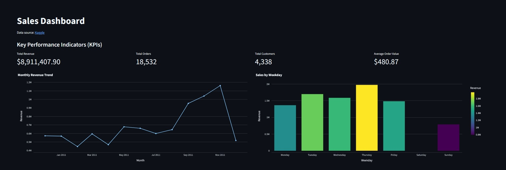
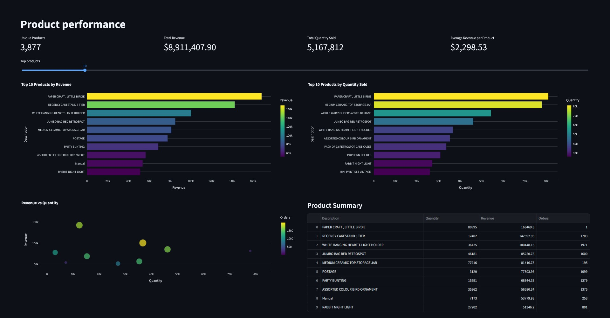
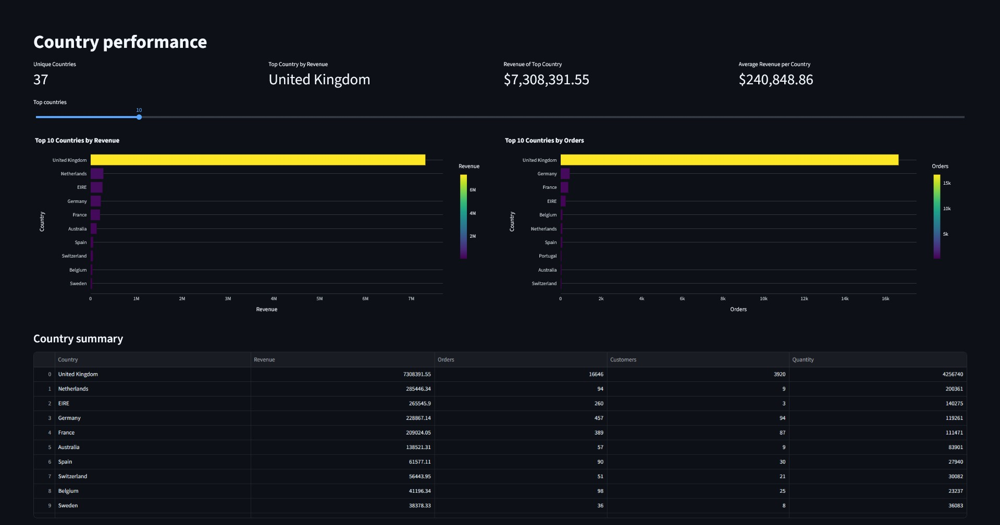
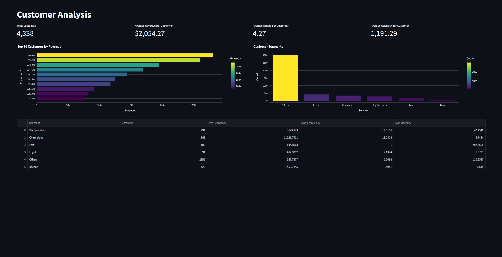

# Sales Analytics Dashboard


[](https://salesanalysis-sknckgqzzj9tvo47wdgovt.streamlit.app/)

## Overview
This project is an interactive sales analytics dashboard built with Streamlit for exploring sales performance across products, markets, and customer segments. It helps identify top-performing products and markets, and uses RFM analysis to distinguish high-value and at-risk customer groups.

## Features
- Interactive dashboard with key business metrics (KPIs)
- Sales trend analysis by month and weekday
- Product performance analysis by revenue and quantity sold
- Country-level sales and order analysis
- Customer segmentation using RFM analysis
- Interactive Plotly visualizations with filtering
- Multi-page Streamlit application

## Dashboard

<p align="center">
  
</p>

The dashboard provides a quick overview of overall sales performance through four key metrics: total revenue, total orders, total customers, and average order value. Monthly and weekday sales charts help identify sales trends, seasonal patterns, and the periods that contribute most to overall revenue.

## Products

<p align="center">
  
</p>

The Products page compares items by revenue, quantity sold, and order frequency to highlight the strongest-performing products. Top N charts and a revenue-versus-quantity comparison help identify products that generate the most revenue, sell in the largest quantities, or perform differently across these metrics.

## Countries

<p align="center">
  
</p>

The Countries page compares markets by revenue, order volume, customer count, and quantity sold to evaluate sales performance across different countries. It helps reveal which markets generate the highest revenue, where customer activity is strongest, and how sales performance differs from one market to another.

## Customers

<p align="center">
  
</p>

The Customers page combines customer revenue, order frequency, and recency metrics with RFM segmentation to evaluate customer purchasing behavior. It helps distinguish loyal, high-value, and at-risk customer groups, compare their contribution to overall sales, and better understand differences between customer segments.

## Dataset

[Kaggle](https://www.kaggle.com/datasets/carrie1/ecommerce-data)

The dashboard is based on the **Online Retail** dataset, which contains transaction records from a UK-based online retailer.

Before building the dashboard, the data went through a preprocessing pipeline in Pandas. The workflow included data cleaning, feature engineering, KPI calculation, RFM segmentation, and the creation of aggregated datasets for products, countries, and customers. These prepared datasets simplify the application logic and allow the dashboard to load visualizations efficiently.

## Technologies

| Technology | Purpose |
|------------|---------|
| Python | Data processing and application logic |
| Pandas | Data cleaning, transformation, and aggregation |
| Streamlit | Interactive dashboard development |
| Plotly | Interactive data visualizations |


## Project Structure

```text
sales-analytics-dashboard/
├── data/              # Processed datasets
├── images/            # README screenshots
├── pages/             # Streamlit pages
├── .streamlit/        # Streamlit configuration
├── app.py             # Application entry point
├── data_loader.py     # Data loading
├── utils.py           # Shared helper functions
├── requirements.txt
└── README.md
```

## Results / Key Insights

- The **United Kingdom** accounts for approximately **82%** of total revenue, making it the primary market in the dataset.
- Revenue is distributed across a broad product portfolio, with the **top 10 products contributing about 10%** of total revenue rather than dominating overall sales.
- RFM segmentation shows that the **"Others"** segment contains the majority of customers, while **Champions**, **Recent**, and **Big Spenders** form smaller customer groups with different purchasing characteristics.
